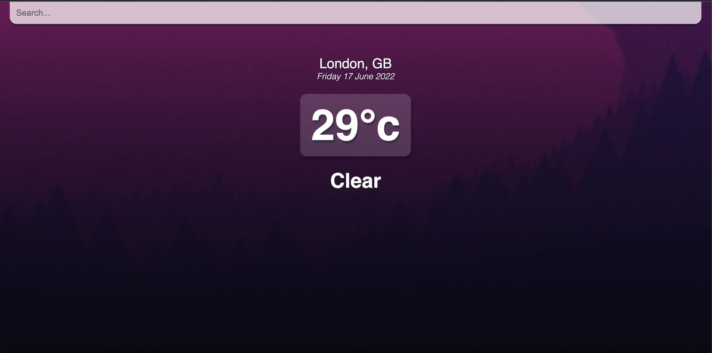

# Weather App

This is a simple weather app coded in React here is a screenshot of the page:

Things I learned and practiced in this project:

- Ternary Operator.
- Fetching data.
- Refactoring code such as creating functions outside of the return where neccessary.
- Transitions, if the weather is hotter than 16°c at the chosen location a warmer background is applied.
- Building today's date using the new Date() Object.
- More useState practice. 
- Learned how to listen for the Enter key being clicked as this is the first time I didn't use a button to search.

